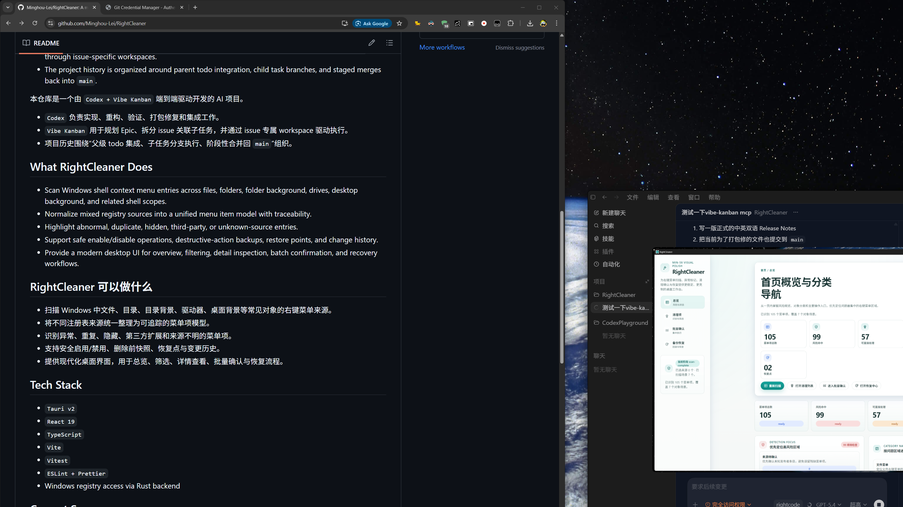
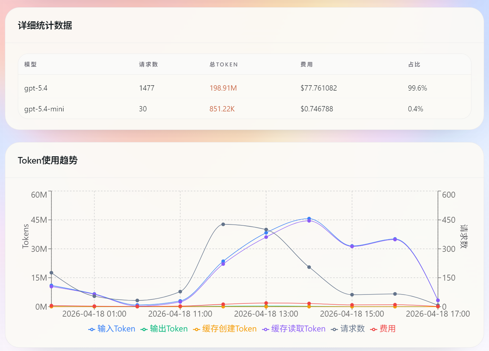

<p align="center">
  
</p>

<h1 align="center">RightCleaner</h1>

<p align="center">
  <strong>A modern Windows shell context menu manager focused on clarity, safety, and recovery.</strong>
</p>

<p align="center">
  <strong>一款现代化的 Windows 右键菜单管理工具，专注于可理解性、安全性与可恢复性。</strong>
</p>

<p align="center">
  <a href="https://github.com/Minghou-Lei/RightCleaner/releases"></a>
  
  
  
  
</p>

<p align="center">
  Built end-to-end with <strong>Codex + Vibe Kanban</strong>.
  <br />
  基于 <strong>Codex + Vibe Kanban</strong> 端到端驱动开发。
</p>

---

## Preview



RightCleaner turns a cluttered and opaque Windows right-click menu into something you can inspect, categorize, filter, disable, back up, and recover with confidence.

RightCleaner 旨在把复杂、混乱、来源不明的 Windows 右键菜单，整理成可以扫描、分类、筛选、禁用、备份和恢复的清晰工作流。

## Why RightCleaner

Windows shell context menu cleanup is often risky because entries come from different registry roots, command styles, shell extensions, and third-party integrations.  
RightCleaner focuses on making those entries:

- visible
- traceable
- classifiable
- actionable
- recoverable

Windows 右键菜单清理之所以困难，是因为菜单项来自不同注册表根路径、不同命令模式、Shell 扩展以及第三方集成。  
RightCleaner 的核心目标，就是让这些菜单项变得：

- 可见
- 可追踪
- 可分类
- 可操作
- 可恢复

## What It Does

- Scan shell context menu entries across files, folders, folder background, drives, desktop background, and related shell scopes.
- Normalize mixed registry sources into a unified menu item model.
- Highlight abnormal, duplicate, hidden, third-party, or unknown-source entries.
- Provide safe enable/disable foundations, backup snapshots, restore points, change history, and elevation-aware mutation workflows.
- Offer a modern desktop UI for overview, filtering, detail inspection, batch confirmation, and recovery.

## 功能概览

- 扫描文件、目录、目录背景、驱动器、桌面背景等常见对象的右键菜单来源。
- 将混合的注册表来源统一整理成一致的菜单项模型。
- 识别异常、重复、隐藏、第三方扩展和来源不明的菜单项。
- 提供安全启用/禁用、删除前快照、恢复点、变更历史以及权限感知的修改流程。
- 提供现代化桌面界面，用于总览、筛选、详情查看、批量确认与恢复。

## Project Status

The repository already includes these implemented project areas:

- `MIN-31` product definition, MVP scope, information architecture, and product direction
- `MIN-32` desktop application foundation, scaffold, routing, state shell, and diagnostics contracts
- `MIN-33` shell context menu scanning engine, registry reader, normalized model, and anomaly detection
- `MIN-34` safe menu management foundations, including toggle, backup, restore, history, and elevation-aware backend work
- `MIN-35` modern management UI, including overview, search/filter/sort, detail panel, batch UX, and visual polish

当前仓库已经实现的核心阶段包括：

- `MIN-31` 产品定义、MVP 范围、信息架构与方向设计
- `MIN-32` 桌面应用基础架构、工程骨架、路由、状态壳层与诊断契约
- `MIN-33` Shell Context Menu 扫描引擎、注册表读取、统一模型与异常识别
- `MIN-34` 安全菜单管理能力基础，包括启用/禁用、快照、恢复、历史记录与权限感知的后端流程
- `MIN-35` 现代化管理界面，包括总览、搜索/筛选/排序、详情面板、批量交互与视觉打磨

## Releases

You can download packaged builds here:

- [GitHub Releases](https://github.com/Minghou-Lei/RightCleaner/releases)
- [Windows Setup (.exe)](https://github.com/Minghou-Lei/RightCleaner/releases/download/v0.1.0/RightCleaner_0.1.0_x64-setup.exe)
- [Windows Installer (.msi)](https://github.com/Minghou-Lei/RightCleaner/releases/download/v0.1.0/RightCleaner_0.1.0_x64_en-US.msi)
- [Portable Executable (.exe)](https://github.com/Minghou-Lei/RightCleaner/releases/download/v0.1.0/rightcleaner.exe)

## Tech Stack

- `Tauri v2`
- `React 19`
- `TypeScript`
- `Vite`
- `Vitest`
- `ESLint + Prettier`
- Rust backend for Windows registry access, mutation safety, backup, and restore flows

## Quick Start

### Web UI

```bash
npm install
npm run dev
```

Open the local URL shown by Vite, usually:

`http://localhost:4173`

### Desktop Development

```bash
npm run tauri dev
```

### Production Build

```bash
npm run tauri build
```

Typical Windows outputs:

- `src-tauri/target/release/rightcleaner.exe`
- `src-tauri/target/release/bundle/nsis/RightCleaner_0.1.0_x64-setup.exe`
- `src-tauri/target/release/bundle/msi/RightCleaner_0.1.0_x64_en-US.msi`

## Repository Structure

- `src/`
  Frontend application code, state, routes, views, and shared UI logic.
- `src-tauri/`
  Rust backend, Tauri shell, registry access, backup, restore, and packaging configuration.
- `docs/`
  Product scope, technical decisions, information architecture, visual baseline, and engineering notes.
- `specs/`
  Structured settings and diagnostics schemas.

## Key Documents

- `docs/MIN-39-mvp-boundary.md`
- `docs/MIN-42-technical-architecture.md`
- `docs/product/MIN-40-information-architecture.md`
- `docs/product/MIN-45-settings-logging-diagnostics.md`
- `docs/visual-baseline.md`
- `docs/engineering-structure.md`

## Development Workflow

This repository follows a parent-task integration model driven by Vibe Kanban:

1. A parent todo is selected in Vibe Kanban.
2. Child subtasks are executed in issue-linked workspaces.
3. Child workspace branches are integrated into a parent branch such as `codex/min33-scan-engine`.
4. The parent branch is validated and merged back into `main`.
5. Temporary workspaces and `vk/*` branches are cleaned up.

本仓库遵循由 Vibe Kanban 驱动的父任务集成工作流：

1. 在 Vibe Kanban 中选择一个父级 todo。
2. 子任务通过 issue 关联的 workspace 执行。
3. 子任务分支先汇总到父级集成分支，例如 `codex/min33-scan-engine`。
4. 父级分支验证通过后再合并回 `main`。
5. 最后清理对应 workspace 与临时 `vk/*` 分支。

## AI-Built Project

This repository is not just AI-assisted. It is structurally developed through a `Codex + Vibe Kanban` workflow:

- `Codex` handled implementation, integration, validation, packaging fixes, and build troubleshooting.
- `Vibe Kanban` handled epic planning, issue decomposition, issue-linked workspaces, and staged execution.
- The project history reflects parent-task integration rather than ad-hoc branch sprawl.

这不是一个“只是用了 AI 辅助”的项目，而是一个由 `Codex + Vibe Kanban` 结构化驱动开发的仓库：

- `Codex` 负责实现、集成、验证、打包修复和构建排障。
- `Vibe Kanban` 负责 Epic 规划、issue 拆分、issue 关联 workspace 和分阶段执行。
- 项目历史遵循“父任务集成”而不是无序堆积的临时分支。

## AI / Token Usage Transparency

<p align="center">
  
  
  
  
  
</p>

<p align="center">
  
  
  
</p>

The project keeps the `Codex + Vibe Kanban` workflow visible not only in code history, but also in usage cost.

项目不仅在代码历史上体现 `Codex + Vibe Kanban` 的开发流程，也尽量透明展示这套流程对应的 Token 与费用开销。

This section is intentionally included in the README to make the development cost profile auditable and concrete, rather than leaving the AI build process as a vague claim.

这个区块特意保留在 README 中，是为了让 `AI 驱动开发` 的成本曲线、模型占比和消耗规模变得可审计、可验证，而不是只停留在抽象表述层面。

### Snapshot

- **Today Requests**: `1,504`
- **Today Tokens**: `197.8M`
- **Today Cost**: `$77.94`
- **Total Requests**: `2,293`
- **Total Tokens**: `264.7M`
- **Total Cost**: `$114.79`

- **当日请求数**：`1,504`
- **当日 Token**：`197.8M`
- **当日费用**：`$77.94`
- **总请求数**：`2,293`
- **总 Token**：`264.7M`
- **总费用**：`$114.79`

### Model Breakdown

- `gpt-5.4`: `1,477` requests, `198.91M` total tokens, `$77.761082`, `99.6%` of tracked spend
- `gpt-5.4-mini`: `30` requests, `851.22K` total tokens, `$0.746788`, `0.4%` of tracked spend

- `gpt-5.4`：`1,477` 次请求，`198.91M` Token，`$77.761082`，占总费用 `99.6%`
- `gpt-5.4-mini`：`30` 次请求，`851.22K` Token，`$0.746788`，占总费用 `0.4%`

### Usage Screenshots

<p align="center">
  
</p>

<p align="center">
  
</p>

These screenshots capture the current cost profile of the project build-out, including request volume, model mix, total token usage, and usage trend.

这两张截图展示了当前项目构建过程中的请求规模、模型占比、总 Token 用量以及使用趋势。

From a repository storytelling perspective, this section matters because it turns `Built with Codex + Vibe Kanban` into something measurable: not only what was built, but also what it cost to build it.

从仓库叙事角度看，这个区块的重要性在于，它把 `Built with Codex + Vibe Kanban` 从一句宣传语变成了可量化事实：不仅展示做了什么，也展示为此付出了多少真实算力成本。

## Next

The next planned work areas are:

- `MIN-36` testing, compatibility, and quality hardening
- `MIN-37` packaging, onboarding, documentation, and release hardening

后续计划继续推进：

- `MIN-36` 测试、兼容性与质量保障
- `MIN-37` 打包、引导、文档与发布强化

## License

This project is licensed under the `0BSD` license.

本项目采用 `0BSD` 许可证发布。

See [LICENSE](LICENSE).
